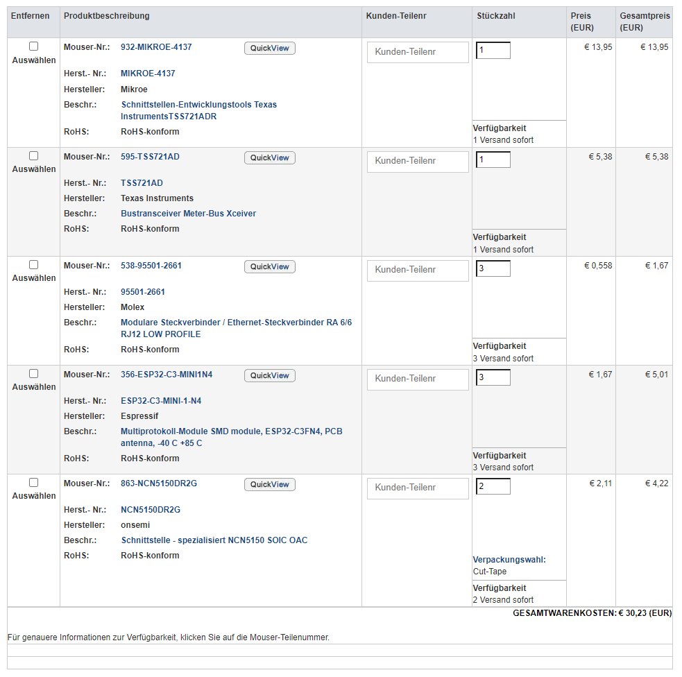

# Documentation of Layblar hardware

The hardware is based on a ESP32-C3 Chip and a M-Bus Transreceiver (TSS721A or NCN5150).

# Changelog

## [Unreleased]

### Added

- Feature 1
- Feature 2

### Changed

- Update 1
- Update 2

### Removed

- Deprecated feature

## 2023-10-07 ([André Maurer](https://github.com/bouncecom))

- Initial release based on [Espressif example project](https://github.com/espressif/esp-idf/tree/master/examples/protocols/mqtt/tcp).

## 2023-10-05 ([André Maurer](https://github.com/bouncecom))

- Selected hardware parts for prototyp
- Sended BoM for ordering
- 

## Contributors

- [Marcel Nague](https://github.com/marcel-nague)
- [Jakob Feistenauer](https://github.com/yescob)
- [André Maurer](https://github.com/bouncecom)