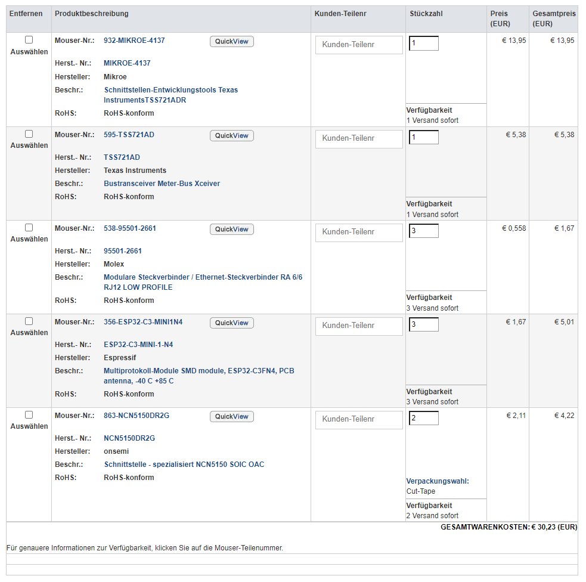

# Documentation of Layblar hardware

The hardware is based on a ESP32-C3 Chip and a M-Bus Transreceiver (TSS721A or NCN5150).

## Layblar PCB

Layblar has its own PCB for handling all the read routines of the smart meter. The PCB is connected to the VKW smart meter via an RJ-12 cable. The ESP32-C3 chip retrieves both frames from the M-Bus Transceiver NCN5150 every 5 seconds. The microcontroller processes these two frames, decrypts the messages, and parses each value into structs for easier handling in the code. A JSON string is built with all available values sent from the smart meter, and a timestamp from the smart meter is added to the JSON string. The JSON string is then sent to the broker via MQTT-S. It uses the serial number of the smart meter as the MQTT topic. The microcontroller has a small buffer to store the JSON string in case of short network issues.

# Changelog

## 2024-01-18 ([André Maurer](https://github.com/bouncecom))

- Fixed date format

## 2024-01-13 ([André Maurer](https://github.com/bouncecom))

- Checked PCB functions

## 2024-01-11 ([André Maurer](https://github.com/bouncecom))

- Added queue to buffer values
- Refactored read routine
- Assembled PCB

## 2024-01-02 ([André Maurer](https://github.com/bouncecom))

- Fixed issues
- Moved read routine to external .c and .h files

## 2023-12-17 ([André Maurer](https://github.com/bouncecom))

- Created PCB design and requested an order permit

## 2023-12-02 ([André Maurer](https://github.com/bouncecom))

- Added json parser and build routine

## 2023-11-23 ([André Maurer](https://github.com/bouncecom))

- Added structs for easier frame handling

## 2023-11-16 ([André Maurer](https://github.com/bouncecom))

- Got decryption with mbedtls working

## 2023-11-09 ([André Maurer](https://github.com/bouncecom))

- Got correct frame parts

## 2023-11-02 ([André Maurer](https://github.com/bouncecom))

- Build both messages together for easier handling

## 2023-10-26 ([André Maurer](https://github.com/bouncecom))

- Got first messages from TSS721A-Evaluationsboard

## 2023-10-12 ([André Maurer](https://github.com/bouncecom))

- Started HW proof of concept with steckboard

## 2023-10-07 ([André Maurer](https://github.com/bouncecom))

- Initial release based on [Espressif example project](https://github.com/espressif/esp-idf/tree/master/examples/protocols/mqtt/tcp).

## 2023-10-05 ([André Maurer](https://github.com/bouncecom))

- Selected hardware parts for prototyp

- Sended BoM for ordering

- 

  

## Contributors

- [Marcel Nague](https://github.com/marcel-nague)
- [Jakob Feistenauer](https://github.com/yescob)
- [André Maurer](https://github.com/bouncecom)