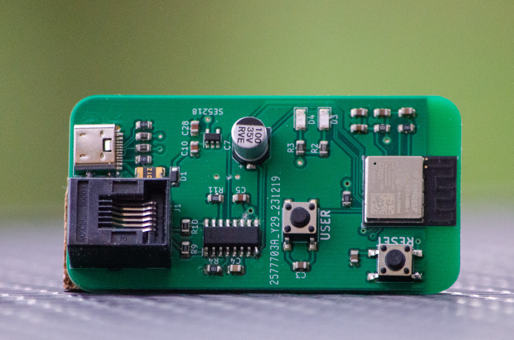
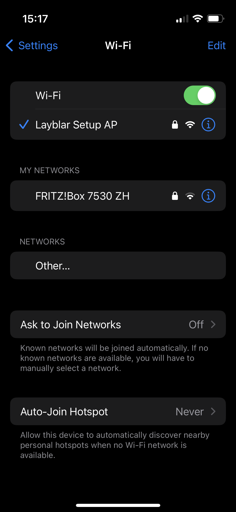
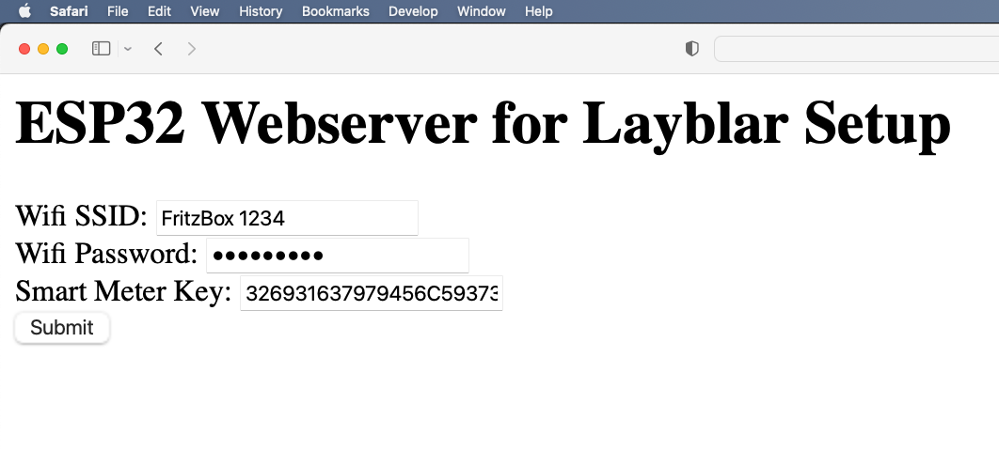

# Documentation of Layblar hardware

The hardware is based on a ESP32-C3 Chip and a M-Bus Transreceiver (TSS721A or NCN5150).

# M-Bus Frames

The Smart Meter sends information about the current values every 5 seconds. The data is too extensive to fit into a single frame, so two M-Bus frames are transmitted consecutively. Each frame consists of an M-Bus Start part, followed by the data, and concluded with an M-Bus Stop part.

## Frame 1

| M-Bus Start | Message 1 | M-Bus Stop |
| ----------- | --------- | ---------- |
| 4 Byte      | 250 Byte  | 2 Byte     |

## Frame 2

| M-Bus Start | Message 2 | M-Bus Stop |
| ----------- | --------- | ---------- |
| 4 Byte      | 114 Byte  | 2 Byte     |

## M-Bus Start

| Start     | Length                     | Length                     | Start     |
| --------- | -------------------------- | -------------------------- | --------- |
| 1 Byte    | 1 Byte                     | 1 Byte                     | 1 Byte    |
| <u>68</u> | FA (Frame 1), 72 (Frame 2) | FA (Frame 1), 72 (Frame 2) | <u>68</u> |

## M-Bus Stop

| Checksum | End       |
| -------- | --------- |
| 1 Byte   | 1 Byte    |
| B6       | <u>16</u> |

## Message 1

| Metadata          | Service   | Title Length | Title                   | APDU Length   | Security  | Frame Counter | Data 1        |
| ----------------- | --------- | ------------ | ----------------------- | ------------- | --------- | ------------- | ------------- |
| 5 Byte            | 1 Byte    | 1 Byte       | 8 Byte                  | 3 Byte        | 1 Byte    | 4 Byte        | 227 Byte      |
| <u>53FF000167</u> | <u>DB</u> | <u>08</u>    | <u>4B464D1020031D00</u> | <u>820155</u> | <u>21</u> | 0001C91E      | 8BEE ... 8BF5 |

## Message 2

| Metadata          | Data 2        |
| ----------------- | ------------- |
| 5 Byte            | 109 Byte      |
| <u>53FF110167</u> | FAF4 ... 57EB |

<u>Underlined values mean that these values are allways the same.</u>

## Decrypt the messages

The sensible informations are encrypted with AES GCM. A encryption key from Smart Meter provider VKW is needed. Encryption also needs a Start Vector whis is defined as `Title` + `Frame Counter`.

The code uses `#include "mbedtls/gcm.h"` for decrypting.

# Script

The script is splitted in different functions, tasks and files for better overview and maintainability.

## smart_meter_init

This function contains all steps for initializing the UART communication between the microcontroller and the M-Bus Transreceiver, creation of the FreeRTOS queue and the creation of the task called `smart_meter_task`.

## smart_meter_task

The task contains the smart meter read routine. The ESP32-C3 chip retrieves both frames from the M-Bus Transceiver NCN5150 every 5 seconds. The task combines both frames into one frame and processes it. There are checks to ensure the correctness of the frame length and header. The encrypted message, called `encry`, and the initialization vector `iv` are parsed from the frame. The decryption is performed using the `mbedtls_gcm` library, and the decrypted message is stored in `decry`. For better parsing of values in `decry`, the struct `dlms_frame` is utilized. A JSON string is constructed with all available values sent from the smart meter, and a timestamp from the smart meter is added to the JSON string. The JSON string is then copied to the FreeRTOS queue.

## smart_meter.c

The c-file `smart_meter.c` contains both `smart_meter_init` and `smart_meter_task` and the struct `dlms_frame` with all substructs. The h-file `smart_meter.h` contains definies for easier frame parsing and fame handling.

## wifi_soft_ap.c

The C file `wifi_soft_ap.c` contains the implementation to create a WiFi Access Point on the ESP32-C3. Each device with WiFi can connect to the Access Point. The Access Point is only built up when the user presses the USER Button while the ESP32-C3 was booting.

## http_server.c

The C file `wifi_soft_ap.c` contains the implementation of an HTTP server. The server hosts a website with three text fields: `Wifi SSID`, `Wifi Password` and `Smart Meter Key` for initializing the Layblar PCB. The server is only online when the USER Button was pressed while the ESP32-C3 was booting. This also means that the server is only reachable over the Access Point of the ESP32-C3.

**Note:** The HTTP server is in development state and therefore not fully functional and stable.

## cJSON

cJSON is an ultralightweight JSON parser in ANSI C.

# JSON format

The values are sent every 5 seconds via MQTT(S) in JSON format.

```json
{
        "1.7.0":        0,
        "1.8.0":        22,
        "2.7.0":        0,
        "2.8.0":        0,
        "3.8.0":        7,
        "4.8.0":        0,
        "32.7.0":       228.8,
        "52.7.0":       228.9,
        "72.7.0":       228.4,
        "31.7.0":       0,
        "51.7.0":       0,
        "71.7.0":       0,
        "timestamp":    "yyyy-MM-ddTHH:mm:ss"
}
```

Note that the timestamp always has this format, e.g. `"timestamp":  "2024-01-11T10:46:05"`.

# Layblar PCB



Layblar has its own PCB for handling all the read routines of the smart meter. The PCB is connected to the VKW smart meter via an RJ-12 cable. The ESP32-C3 chip retrieves both frames from the M-Bus Transceiver NCN5150 every 5 seconds. The microcontroller processes these two frames, decrypts the messages, and parses each value into structs for easier handling in the code. A JSON string is built with all available values sent from the smart meter, and a timestamp from the smart meter is added to the JSON string. The JSON string is then sent to the broker via MQTT-S. It uses the serial number of the smart meter as the MQTT topic. The microcontroller has buffer to store the JSON strings in case of short network issues.

## USER Button

For initial setup, the user has to press the USER Button while the ESP32-C3 is booting. This action creates a WiFi Access Point. Each device with WiFi can connect to the Access Point and open the Setup Website via an internet browser.



The website contains three text fields: `Wifi SSID`, `Wifi Password`, and `Smart Meter Key` for initializing the Layblar PCB.



## LEDs (Yellow and Blue)

There are two LEDs on the Layblar PCB: Yellow and Blue. The table show how to interpret the LEDs:

| LEDs /Modes | Setup Init Mode                                 | Measurement Mode                                             |
| ----------- | ----------------------------------------------- | ------------------------------------------------------------ |
| Yellow      | ON: Setup done before (old values detected)     | ON: Smart Meter connected and decryption successfully TOGGLE: Smart Meter connected but decryption failed (check key) |
| Blue        | ON: Wifi Access Point created, ready to connect | ON: PCB could connect to initalised Wifi Router TOGGLE: Could not connect to Wifi Router (check Wifi range or Wifi SSID / Password) |


## Troubles

The assembled PCB encountered issues, as the microcontroller could not receive correct messages from the M-Bus Transceiver. Upon inspecting the communication via an oscilloscope, only fragments of the expected frame were transmitted. This issue could be attributed to a voltage drop. After disconnecting pin VDD of the M-Bus Transceiver from the 3.3V power supply, the communication worked perfectly. The M-Bus Transceiver is now solely powered by the M-Bus communication from the smart meter, without relying on the 5V-to-3V3 converter powered by USB.

# Changelog

## Contributors

- [André Maurer](https://github.com/bouncecom)

## 2024-02-28

- Added docs

## 2024-01-24

- Added WiFi AccessPoint (AP) when USER Button in pressed while booting
- Added HTTP Webserver (dev state, not fully functional and stable)
- Updated bugfix also in KiCad
- Added docs

## 2024-01-18

- Fixed date format
- Fixed not working PCB
- Added docs
- Code cleanup

## 2024-01-13

- Checked PCB functions

## 2024-01-11

- Added queue to buffer values
- Refactored read routine
- Assembled PCB

## 2024-01-02

- Fixed issues
- Moved read routine to external .c and .h files

## 2023-11-26

- Created first version of PCB used KiCad.
- Created new repository for PCB.
- Created doc files for PCB.

## 2023-11-24

- Reverse engineered data frame format as there is no good documentation from vkw (other provider has some documentation as orientation)
- Added documentation.
- Refactored data frame structure using #define instead of size_t for better data handling.
- Error search of failing decryption. 

## 2023-11-11

- Got evaluation board running (proof of concept).
- Got correct signals form evaluation board via UART.
- Started implementation of decryption.


## 2023-10-07

- Initial release based on [Espressif example project](https://github.com/espressif/esp-idf/tree/master/examples/protocols/mqtt/tcp).

## 2023-10-05

- Selected hardware parts for prototyp
- Sended BoM for ordering
- <a href="https://layblar.github.io/layblar_esp32/img/order_05102023.png" target="_blank">Shopping List</a>